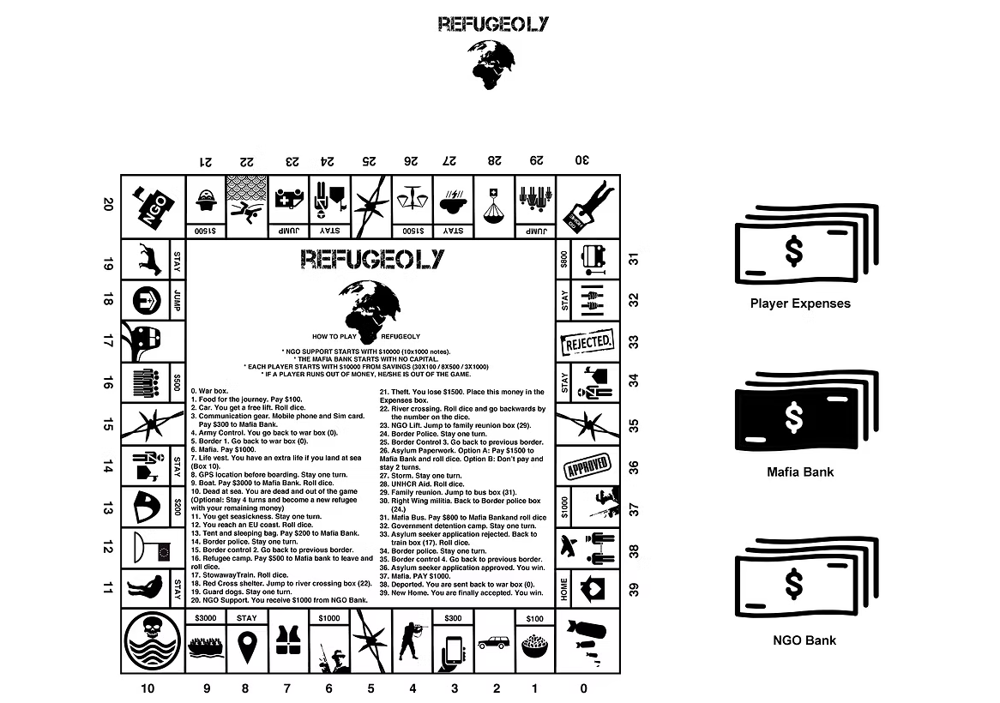

# Refugeoly-JavaProject🎲

## This repository contains the full implementation of the Refugeoly game — a Java-based educational board game inspired by Monopoly, developed as part of the Object-Oriented Programming course at the University of Peloponnese. The game aims to simulate the refugee journey, highlighting the difficulties faced and the financial aspects involved, through a turn-based digital version of the real game.

## Features
- Developed entirely in Java using NetBeans (Java with Ant project)
- Follows full object-oriented design principles
- Implements all game entities:
    - Refugee players (with name, money, position, and expenses)
    - NGO Bank and Mafia Bank
    - Game board and squares with actions
    - Action classes such as PayMoneyAction, GoToAction, RollDiceAction, etc.
- Supports save/load game functionality
- Full game logic with turn control, dice rolling, and event handling

## Requirements
- Java Development Kit (JDK) 17 or later
- NetBeans IDE (tested on version 18 or later)

## Installation & Run
1. Clone the repository
    ```bash
    git clone https://github.com/username/refugeoly.git
    ```
2. Open the project in NetBeans
    - Go to File → Open Project
    - Select the folder Refugeoly
3. Build and Run
    - Click Run Project or press Shift + F6 in NetBeans

## How It Works
- Players roll a die and move around the board.
- Each square triggers one or more Action objects (e.g., pay money, move, receive money).
- All transactions follow the rules of the game, with players possibly going bankrupt or completing the journey.

## Games Board
